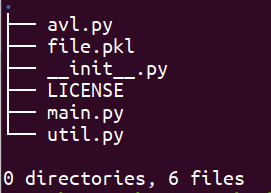
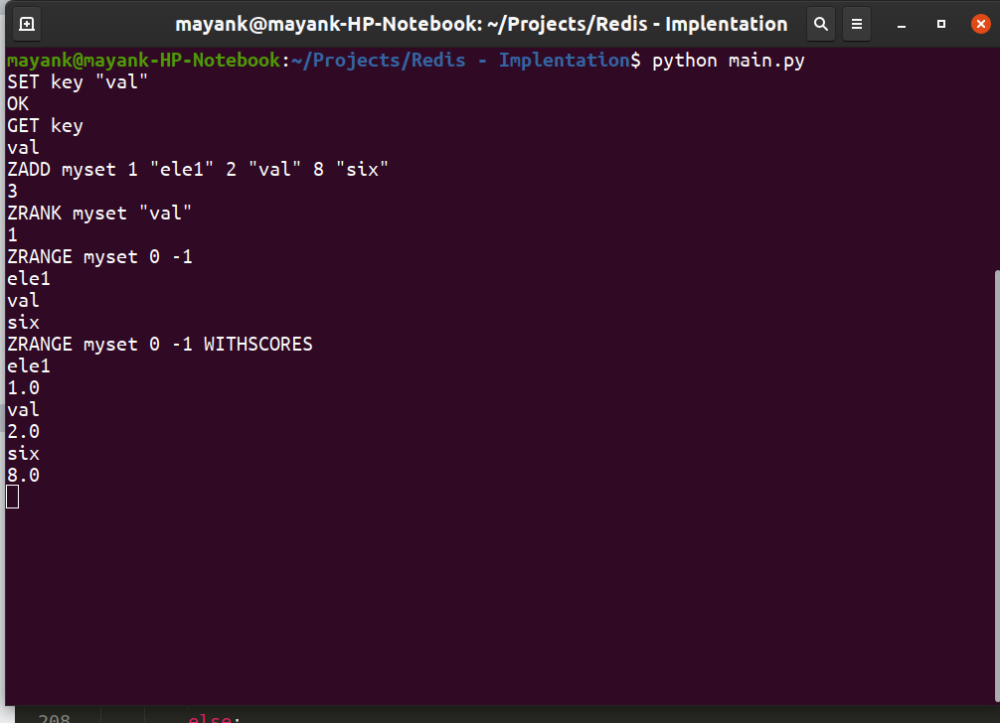

# Redis-Implemention in python
This is a basic implementation of Redis with some basic functionalities like -
1. **GET**(https://redis.io/commands/get)
2. **SET**(https://redis.io/commands/set)
3. **EXPIRE**(https://redis.io/commands/expire)
4. **ZADD**(https://redis.io/commands/zadd)
5. **ZRANK**(https://redis.io/commands/zrank)
6. **ZRANGE**(https://redis.io/commands/zrange)

To run the code in your system you must have python>3.x. [Download and install here](https://www.python.org/downloads/)

## Repo Tree


## Clone the current repo <br>
`https://github.com/may55/Redis-Implemention.git`

## Run redis<br>
`python3 main.py`

## Executable Commands
```
SET <key> value(string)
GET <key>
EXPIRE <key> <time-in-sec>
ZADD <set-name> <score1(float)> <element1(string)> <score2> <element2> ...
ZRANK <set-name> <element(string)>
ZRANGE <set-name> <start(int)> <end(int)>
```
### Example Commands
```
SET key "val"
GET key
ZADD myset 1 "val" 2 "ele"
ZRANK myset "val"
ZRANGE myset 0 -1
```


## Demo Run

